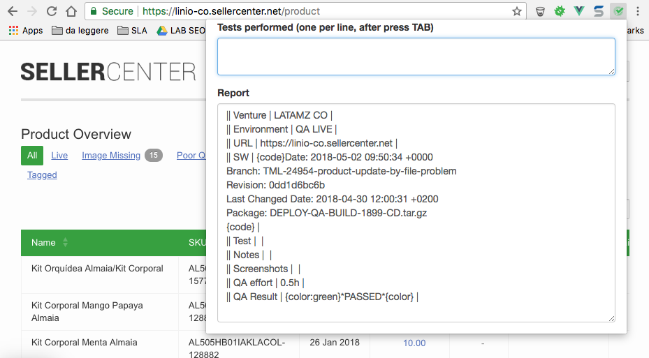
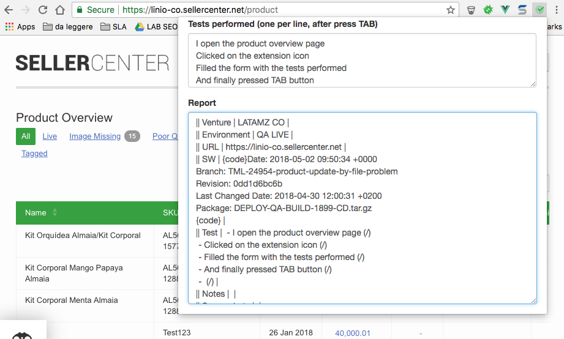
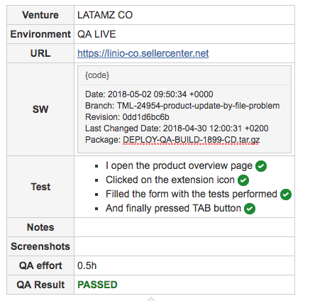

# Chrome Extension: QA tools
An helper for creating QA feedback messages

## Setup
* Clone the project locally
* Open "Google Chrome" settings menu > More Tools > Extensions
* Click on "Load unpacked" button and specify the folder of the just cloned extension

## Pre requisite
This extension only works if the current page belongs to one QA servers.
In a next version will work also on LIVE instances

| VENTURE   | ENVIRONMENT  | URL                                                     |
|-----------|--------------|---------------------------------------------------------|
| latamz_co | staging      | https://sellercenter-staging-linio-co.sellercenter.net  | 
| latamz_ve | staging      | https://sellercenter-staging-linio-ve.sellercenter.net  | 
| nafamz_eg | staging      | https://sellercenter-staging-jumia-eg.sellercenter.net  | 
| nafamz_ng | staging      | https://sellercenter-staging-jumia-ng.sellercenter.net  | 
| seaamz_id | staging      | https://sellercenter-staging-lazada-id.sellercenter.net | 
| seaamz_my | staging      | https://sellercenter-staging-lazada-my.sellercenter.net | 
| seaamz_th | staging      | https://sellercenter-staging-lazada-th.sellercenter.net | 
| latamz_co | live         | https://linio-co.sellercenter.net                       | 
| latamz_ve | live         | https://linio-ve.sellercenter.net                       | 
| nafamz_eg | live         | https://jumia-eg.sellercenter.net                       | 
| nafamz_ng | live         | https://jumia-ng.sellercenter.net                       | 
| seaamz_id | live         | https://lazada-id.sellercenter.net                      | 
| seaamz_my | live         | https://lazada-my.sellercenter.net                      | 
| seaamz_th | live         | https://master.sellercenter.net                         | 

## Example
* Browse to any page of **Linio CO Live** (https://linio-co.sellercenter.net), for example product overview 
* Click on the extension icon as in the following image, a popup will. 



* Fill the field **Tests Performed** with all tests you performed, one per line
* Press TAB button to generate the snippet in Mark-Down syntax.



* Now you can copy the just generate snippet from the **Report** field and paste it in **JIRA issue comment**, using the **TEXT 
mode TAB**




# An example of code

```
|| Venture | LATAMZ CO |
|| Environment | QA LIVE |
|| URL | https://linio-co.sellercenter.net |
|| SW | {code}Date: 2018-05-02 09:50:34 +0000
Branch: TML-24954-product-update-by-file-problem
Revision: 0dd1d6bc6b
Last Changed Date: 2018-04-30 12:00:31 +0200
Package: DEPLOY-QA-BUILD-1899-CD.tar.gz
{code} |
|| Test |  - I open the product overview page (/)
 - Clicked on the extension icon (/)
 - Filled the form with the tests performed (/)
 - And finally pressed TAB button (/)|
|| Notes |  |
|| Screenshots |  |
|| QA effort | 0.5h |
|| QA Result | {color:green}*PASSED*{color} |
```